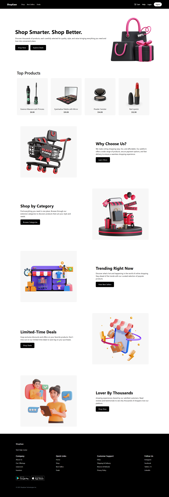

# 🛍️ ShopEase — Basic E-Commerce UI


**ShopEase** is a **basic e-commerce website UI** built as a **frontend learning project**, with a primary focus on mastering **Tailwind CSS** and modern responsive layouts.

🌐 **Live Demo:** https://ar-shopease.vercel.app/

---

## Project Purpose

This project was developed mainly to:
- Learn and practice **Tailwind CSS utility-first styling**
- Build clean, responsive layouts efficiently
- Understand how e-commerce style UIs are structured on the frontend

> ⚠️ This project focuses on **UI & design only** and does **not** include cart functionality, backend logic, or user authentication.

---

## Preview

**Home / Product Listing Page**  


---

## Features & Highlights

- **Responsive Design** — works smoothly on mobile, tablet, and desktop
- **Product Listing UI** — clean product cards with pricing and visuals
- **Tailwind-Driven Styling** — spacing, typography, grids, and layouts built entirely using Tailwind CSS
- **Modern UI Layout** — minimal and user-friendly ecommerce interface
- **Frontend-Only Project** — no cart, checkout, or backend integration

---

## Tech Stack

- **React** — component-based UI development
- **Tailwind CSS** — utility-first CSS framework (core learning focus)
- **JavaScript (ES6+)**
- **Vite** — fast development & build tool
- **Vercel** — deployment platform

---

## Project Structure

Basic-Ecommerce/

├── public/ # Static assets

├── src/ # React components & pages

├── package.json # Dependencies & scripts

├── vite.config.js # Vite configuration

└── README.md # Documentation


---

## 🚀 Run Locally

1. **Clone the repository**
   ```bash
   git clone https://github.com/Rahumansgit/Basic-Ecommerce.git
   
2. **Navigate to the project**
   ```bash
   cd Basic-Ecommerce


3. **Install dependencies**
   ```bash
   npm install


4. **Start the development server**
   ```bash
   npm run dev

